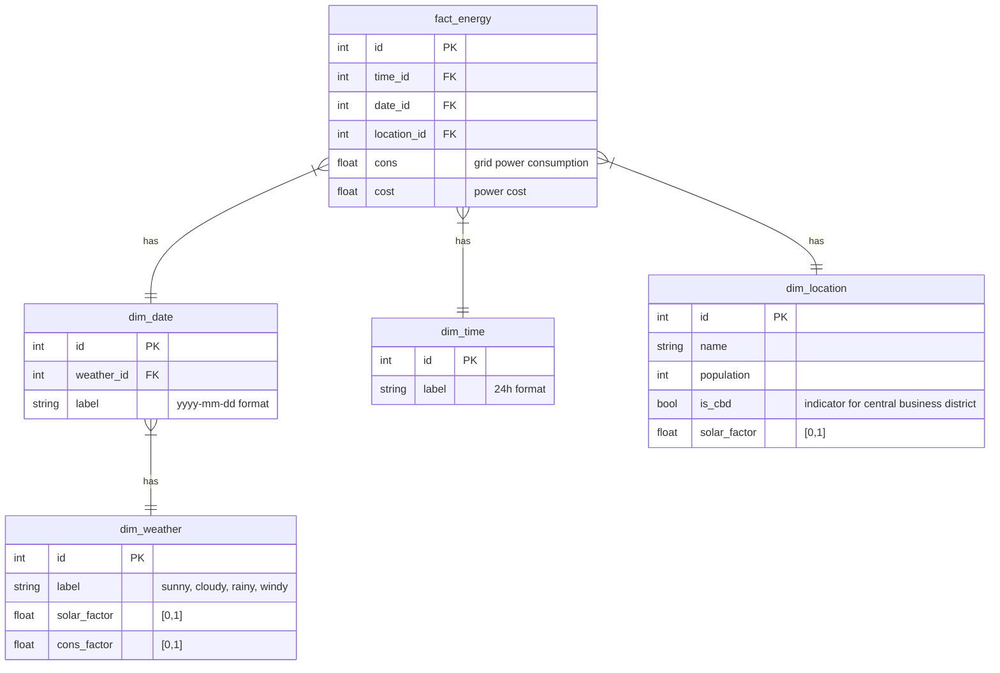

# Duck Viz

This is a small project to test out some BI-as-Code data visualation tools and
data validation tools.

## Data Visualation tools

- Rill ! Todo

## Data Validation tools

- Soda ! Todo

## Data

The data is generated by the generator/main.go file and is stored in DuckDB. If
you wish to run the file yourself you can use `cd gpenerator && go run main.go`
or `cd generator && go build && ./generator`. This will overwrite your current
`data.db` and `mart_energy.parquet` files

DuckDB is a lightweight OLAP DB like sqlite, but for analytics.

The data itself is 1 year's worth of simulated energy related data by minute.

### Data Model

